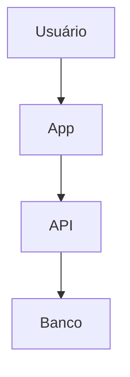

# Cognit — Blueprint do Produto

> **Status:** Documento-base de visão, arquitetura de produto e roadmap  
> **Nome:** Cognit  
> **Posicionamento:** Workspace mobile de arquitetura e desenvolvimento orientado por IA  
> **Plataforma inicial:** React Native + Expo  
> **Objetivo deste documento:** servir como contexto central para desenvolvimento humano e para agentes de IA que trabalhem no projeto.

---

## 1. Visão

O **Cognit** é um ambiente mobile para organizar e executar um workflow moderno de desenvolvimento de software orientado por IA.

A ideia central não é criar um “VS Code no celular”. O Cognit deve ser uma ferramenta de **arquitetura, raciocínio, documentação, visualização, revisão e execução**, na qual a IA atua como uma parceira de transformação entre ideias e artefatos reais de um projeto.

O fluxo ideal é:

**Pensar → desenhar → estruturar → documentar → pedir para a IA transformar → revisar → editar → executar → sincronizar**

O código continua existindo, mas deixa de ser necessariamente o ponto inicial do processo.

O Cognit deve permitir que o usuário comece por um desenho, um diagrama, um documento Markdown, uma solicitação em linguagem natural ou um arquivo existente e, a partir disso, avance até uma implementação ou alteração real no projeto.

---

## 2. Problema

Hoje, um workflow típico pode exigir várias ferramentas:

- Excalidraw para rascunhos;
- Draw.io para diagramas;
- editor de Markdown para documentação;
- editor de Mermaid;
- GitHub para repositórios;
- terminal/SSH para servidores;
- cliente de banco de dados;
- editor de código;
- diferentes interfaces de IA;
- ferramentas de documentação;
- navegador para consultar tudo isso.

No desktop isso já gera atrito. No mobile, o problema é maior.

O Cognit busca centralizar as etapas relevantes desse processo em uma única experiência mobile.

---

## 3. O que o Cognit NÃO é

O Cognit não deve tentar ser:

- um clone completo do VS Code;
- uma IDE tradicional para programação pesada;
- um substituto perfeito de todos os editores desktop;
- um sistema gigantesco cheio de menus;
- uma ferramenta que obriga o usuário a começar pelo código.

O foco é **workflow**, não quantidade de funcionalidades.

A pergunta principal do produto deve ser:

> “O que o arquiteto/desenvolvedor está tentando construir ou entender agora?”

E não:

> “Qual arquivo você quer abrir?”

---

# 4. Público-alvo inicial

O público inicial ideal é formado por:

- desenvolvedores que usam IA diariamente;
- desenvolvedores solo;
- arquitetos de software;
- tech leads;
- profissionais que prototipam sistemas;
- pessoas que trabalham com documentação técnica;
- pessoas que utilizam VPS/GitHub;
- usuários que querem revisar código gerado por IA;
- usuários que precisam trabalhar parcialmente pelo celular.

O produto deve nascer para resolver o workflow do próprio criador.

Isso é uma vantagem.

O Cognit não precisa tentar resolver todos os workflows possíveis no início. Deve primeiro resolver muito bem o workflow que motivou sua criação.

---

# 5. Conceito central

## Workflow de Arquiteto de Software

O Cognit deve se posicionar como um:

> **AI Workspace para arquitetura e desenvolvimento de software.**

Ou, de forma mais conceitual:

> **Um workflow mobile de arquiteto de software, no qual documentos, diagramas, código, infraestrutura e IA trabalham juntos.**

O usuário pode:

1. pensar;
2. desenhar;
3. criar um diagrama;
4. transformar o diagrama em Mermaid;
5. gerar documentação Markdown;
6. pedir alterações à IA;
7. revisar o resultado;
8. editar manualmente;
9. enviar para GitHub;
10. conectar a uma VPS;
11. executar comandos;
12. consultar dados;
13. continuar iterando.

---

# 6. Princípio mais importante: IA como cola

A IA não deve ser apenas um chatbot dentro do aplicativo.

Ela deve funcionar como a **camada de transformação entre os artefatos**.

Exemplos:

### Desenho → Mermaid

Usuário desenha livremente.

Solicita:

> “Transforme esse desenho em um fluxograma Mermaid.”

A IA analisa o desenho e cria um arquivo Mermaid.

### Mermaid → Markdown

Usuário possui um diagrama.

Solicita:

> “Crie uma documentação explicando esse fluxo.”

A IA cria ou atualiza um arquivo `.md`.

### Código → documentação

Usuário seleciona arquivos.

Solicita:

> “Documente a arquitetura desse módulo.”

A IA cria Markdown e diagramas quando apropriado.

### Código → diagrama

Usuário solicita:

> “Mostre a arquitetura desse código.”

A IA gera um diagrama Mermaid.

### Markdown → implementação

Usuário possui uma especificação.

Solicita:

> “Implemente o que está descrito neste documento.”

A IA pode produzir alterações de código, preferencialmente como diff para revisão.

---

# 7. Artefatos como unidade fundamental

O Cognit deve trabalhar com **artefatos**, e não somente mensagens de chat.

Tipos iniciais:

- `.md`
- `.mermaid`
- `.mmd`
- arquivos de código;
- arquivos de configuração;
- desenhos/canvas;
- eventualmente arquivos de projeto.

A IA deve ser capaz de:

- criar artefatos;
- editar artefatos;
- transformar artefatos;
- relacionar artefatos;
- revisar artefatos;
- sugerir alterações;
- gerar novos arquivos.

Uma resposta da IA que resulta em um arquivo deve, quando possível, virar um arquivo real dentro do workspace.

---

# 8. Editor Mermaid

O editor Mermaid é um dos pilares do Cognit.

## Objetivos

Permitir:

- editar Mermaid;
- visualizar o resultado;
- alternar entre código e visualização;
- criar diagramas;
- revisar diagramas gerados por IA;
- salvar arquivos;
- importar arquivos;
- exportar diagramas;
- sincronizar com projetos.

## Diagramas

O Cognit deve suportar os tipos de diagramas disponíveis no Mermaid conforme a capacidade da versão utilizada.

Exemplos:

- flowchart;
- sequence diagram;
- class diagram;
- state diagram;
- ER diagram;
- journey;
- gantt;
- mindmap;
- timeline;
- architecture diagram;
- outros tipos suportados pelo Mermaid.

O aplicativo não deve limitar artificialmente o usuário a um único tipo.

---

# 9. Mermaid como tecnologia

O Mermaid é uma tecnologia open source e deve ser tratado como uma dependência de visualização/edição do produto.

O Cognit não precisa reinventar o mecanismo de renderização.

A aplicação deve aproveitar a implementação existente sempre que possível.

O custo do Mermaid em si não deve ser tratado como custo de API por usuário.

Os principais custos variáveis do Cognit tendem a ser:

- IA;
- infraestrutura;
- armazenamento;
- execução de comandos;
- proxies;
- conexões externas;
- eventualmente processamento pesado.

---

# 10. Canvas livre

Além do Mermaid, o Cognit deve possuir um **canvas livre**.

Importante:

> O canvas livre e o Mermaid são módulos distintos.

O canvas não precisa ser um editor Mermaid.

O usuário deve poder simplesmente pensar e desenhar.

## Objetivo

Servir como espaço para:

- rascunhos;
- fluxos;
- arquitetura inicial;
- caixas;
- setas;
- anotações;
- ideias;
- esquemas;
- planejamento;
- brainstorming visual.

Não é necessário reproduzir todo o Excalidraw.

A experiência deve ser mobile-first.

---

# 11. Canvas + IA

A IA é responsável por conectar o canvas ao restante do workflow.

Exemplo:

1. usuário abre Canvas;
2. desenha livremente;
3. seleciona o desenho;
4. chama a IA;
5. pede:
   “Transforme isso em um fluxograma Mermaid.”
6. Cognit analisa o desenho;
7. cria um novo artefato Mermaid;
8. abre o editor Mermaid;
9. usuário revisa;
10. salva no projeto.

Outras transformações possíveis:

- desenho → Mermaid;
- desenho → Markdown;
- desenho → arquitetura;
- desenho → checklist;
- desenho → especificação;
- desenho → plano de implementação.

---

# 12. Markdown

Markdown deve ser outro pilar principal.

O Cognit deve oferecer:

- editor Markdown;
- preview;
- suporte a Mermaid embutido;
- criação via IA;
- edição via IA;
- exportação;
- importação;
- armazenamento local;
- sincronização com projeto.

A experiência deve favorecer documentos técnicos.

Exemplos:

- README;
- arquitetura;
- decisões técnicas;
- especificações;
- fluxos;
- requisitos;
- documentação de APIs;
- planos;
- ADRs;
- notas técnicas.

---

# 13. Markdown + Mermaid

Uma das combinações mais importantes do produto é:

**Markdown + Mermaid**

Exemplo conceitual:

```markdown
# Arquitetura

O usuário acessa o aplicativo.



A API processa os dados...
```

O usuário deve conseguir visualizar esse documento de forma confortável no celular.

---

# 14. Exportação

Exportações desejadas:

- PNG;
- SVG;
- PDF;
- Markdown;
- arquivos Mermaid.

Prioridade inicial:

1. PNG;
2. SVG;
3. PDF.

A exportação deve ser pensada tanto para diagramas quanto para documentos quando tecnicamente aplicável.

---

# 15. Workspace de projeto

O Cognit deve trabalhar com a ideia de **workspace**.

Um workspace pode representar:

- projeto GitHub;
- projeto local;
- projeto em VPS;
- diretório remoto;
- conjunto de documentos;
- eventualmente múltiplas fontes.

Exemplo:

```text
Meu Projeto
├── README.md
├── docs/
│   ├── architecture.md
│   ├── flow.mmd
│   └── database.md
├── src/
│   ├── api.ts
│   └── service.ts
└── ...
```

A interface deve permitir navegar pelos arquivos sem tentar reproduzir um IDE completo.

---

# 16. GitHub

O Cognit deve oferecer integração com GitHub.

## Objetivos

O usuário deve poder:

- autenticar;
- listar repositórios;
- abrir um repositório;
- navegar por arquivos;
- visualizar arquivos;
- editar arquivos;
- criar arquivos;
- criar commits;
- visualizar alterações;
- revisar diffs;
- eventualmente abrir pull requests;
- sincronizar alterações.

## Princípio

O GitHub deve ser uma das fontes de verdade do projeto.

O Cognit deve facilitar a revisão e alteração pelo celular.

---

# 17. Editor de código mobile

O editor de código não precisa competir com VS Code.

O objetivo é permitir alterações pequenas e revisões.

Casos de uso:

- corrigir uma linha;
- alterar uma configuração;
- ajustar uma variável;
- corrigir uma URL;
- adicionar uma propriedade;
- revisar código gerado pela IA;
- fazer uma pequena correção;
- visualizar contexto.

O editor deve priorizar:

- legibilidade;
- busca;
- edição;
- undo/redo;
- seleção;
- diff;
- salvar;
- commit.

Não é necessário implementar todos os recursos de uma IDE desktop.

---

# 18. Revisão por diff

Esse deve ser um recurso importante.

Quando a IA modificar arquivos:

1. mostrar quais arquivos foram alterados;
2. mostrar diff;
3. permitir revisar;
4. permitir aceitar;
5. permitir rejeitar;
6. permitir editar manualmente;
7. somente então persistir/commit.

Isso reduz o risco de a IA modificar algo sem supervisão.

---

# 19. VPS e SSH

A integração com VPS deve existir como uma opção separada do GitHub.

Nem todo usuário terá uma VPS.

Portanto:

- GitHub deve funcionar sozinho;
- VPS/SSH deve ser opcional.

## Arquitetura recomendada

Não colocar uma conexão SSH sensível diretamente no app mobile como regra geral.

O ideal é existir uma camada backend/control-plane.

Fluxo:

```text
App Mobile
    |
    | HTTPS
    v
Cognit API
    |
    | SSH
    v
VPS do usuário
```

O backend pode:

- abrir conexão SSH;
- executar comandos;
- transmitir stdout/stderr;
- controlar sessão;
- autenticar;
- gerenciar credenciais;
- aplicar limites;
- registrar eventos.

---

# 20. Terminal

O Cognit deve possuir terminal integrado.

A experiência deve parecer um terminal real, mas o app não precisa implementar um shell inteiro.

O terminal deve principalmente:

- conectar;
- enviar comandos;
- receber stdout;
- receber stderr;
- interpretar ANSI;
- suportar cores;
- permitir scroll;
- copiar/colar;
- enviar teclas;
- redimensionar terminal;
- manter sessão quando possível.

---

# 21. xterm.js

Para a interface visual do terminal, **xterm.js** é uma opção forte.

Ele resolve boa parte da complexidade de:

- ANSI;
- cores;
- cursor;
- terminal virtual;
- rendering;
- interação.

Entretanto, React Native/Expo não possui um ambiente DOM completo como um navegador.

Portanto, a estratégia prática pode ser:

```text
React Native / Expo
        |
        v
     WebView
        |
        v
     xterm.js
        |
        v
 WebSocket / transporte
        |
        v
    Cognit API
        |
        v
       SSH
```

A WebView deve ficar isolada no módulo de terminal.

Isso permite manter o restante do aplicativo nativo.

---

# 22. Vim

O objetivo não deve ser “implementar Vim”.

O terminal deve simplesmente permitir que o usuário rode:

```bash
vim arquivo.md
```

ou:

```bash
nvim arquivo.ts
```

quando estiver conectado a uma VPS.

O xterm.js/renderizador deve cuidar da apresentação do terminal.

A lógica do Vim continua no servidor.

Isso é muito mais simples.

---

# 23. Banco de dados

O aplicativo não deve conectar diretamente do celular a bancos de dados privados como regra geral.

Arquitetura:

```text
App
 |
 | HTTPS
 v
Cognit API
 |
 | DB protocol
 v
Database
```

A API deve controlar:

- autenticação;
- credenciais;
- permissões;
- consultas;
- resultados;
- limites;
- auditoria;
- conexões.

## Interface inicial

A seção de banco deve priorizar:

- conexão;
- tabelas;
- schema;
- busca;
- visualização;
- consultas;
- resultados;
- filtros;
- detalhes de registros.

Evitar inicialmente transformar isso em um DBA completo.

---

# 24. IA

A IA é um dos principais pilares do Cognit.

Ela deve ser tratada como uma camada de orquestração.

O aplicativo não deve depender necessariamente de uma única empresa/modelo.

Arquitetura:

```text
App
 |
 | HTTPS
 v
Cognit AI Gateway
 |
 +--> Provider A
 |
 +--> Provider B
 |
 +--> Provider C
```

O backend deve controlar as chaves dos provedores quando o usuário estiver usando a infraestrutura do Cognit.

Nunca colocar uma chave secreta permanente de provedor diretamente no aplicativo.

---

# 25. Chaves de IA

Para o modo gerenciado pelo Cognit:

```text
Usuário
   |
   v
App
   |
   v
Cognit Backend
   |
   v
AI Provider
```

A chave do provedor fica no backend.

O app nunca deve receber a chave secreta do provedor.

---

# 26. BYOK

No futuro, oferecer:

**Bring Your Own Key**

O usuário poderia cadastrar sua própria chave de IA.

Nesse modelo:

- o usuário paga diretamente o provedor;
- o Cognit pode cobrar apenas pelo recurso/infraestrutura, se aplicável;
- usuários avançados ganham mais controle.

Isso também pode reduzir o risco financeiro do Cognit.

---

# 27. Modelo de monetização

O Cognit deve evitar bloquear a principal proposta de valor cedo demais.

A IA é uma das razões centrais para utilizar o produto.

Portanto, o modelo sugerido é:

## Free

- editor Mermaid;
- canvas;
- Markdown;
- visualização;
- armazenamento local;
- integração básica com GitHub;
- IA com limite;
- recursos essenciais.

## Pro

- maior limite de IA;
- contexto maior;
- mais gerações;
- terminal/SSH;
- recursos avançados;
- sincronização avançada;
- banco de dados;
- histórico avançado;
- automações;
- mais projetos;
- recursos premium.

## Enterprise / futuro

- equipes;
- organizações;
- políticas;
- auditoria;
- controle de acesso;
- provedores próprios;
- infraestrutura dedicada.

---

# 28. Sistema de créditos

Uma possibilidade é usar créditos internamente.

Exemplo:

```text
Plano Free
100 créditos / dia

Plano Pro
créditos muito maiores ou uso justo
```

Entretanto, a interface não deve transformar o aplicativo em uma “máquina de moedas”.

O usuário deve entender facilmente:

> “Quanto posso usar?”

e não:

> “Quantos tokens gastarei nesta frase?”

O sistema de créditos deve ficar principalmente nos bastidores.

---

# 29. Limites gratuitos

O Free pode ter:

- limite diário;
- limite por modelo;
- fila em horários de pico;
- modelos menores;
- limite de contexto.

Quando o limite acabar:

> “Você atingiu o limite gratuito. Seu uso será liberado novamente em X.”

O objetivo é permitir experimentar o produto de verdade.

---

# 30. Possível monetização adicional

Além da assinatura:

- armazenamento adicional;
- processamento pesado;
- agentes/automações;
- execução remota;
- recursos avançados de infraestrutura;
- equipes;
- integrações profissionais.

Evitar transformar recursos básicos de edição em paywall.

---

# 31. Anúncios

Anúncios devem ser considerados com cuidado.

Como o público é técnico, anúncios intrusivos podem prejudicar a percepção do produto.

Se forem usados:

- nunca interromper o fluxo;
- nunca aparecer dentro do editor;
- preferir publicidade discreta;
- avaliar recompensas opcionais quando fizer sentido.

Uma possibilidade é:

> assistir a uma recompensa para obter temporariamente mais uso de um recurso caro.

Isso deve ser validado por testes reais.

---

# 32. Privacidade e segurança

O Cognit manipulará informações potencialmente muito sensíveis:

- código;
- tokens;
- credenciais;
- diagramas;
- documentação;
- banco de dados;
- servidores.

Portanto, segurança deve ser parte da arquitetura desde o começo.

Nunca:

- armazenar senha em texto puro;
- expor chaves de IA no app;
- enviar credenciais desnecessárias;
- registrar secrets em logs;
- transmitir banco sem TLS.

Priorizar:

- TLS;
- criptografia em repouso;
- secrets manager;
- tokens de curta duração;
- permissões mínimas;
- logs sem credenciais;
- isolamento por usuário;
- revogação de sessões.

---

# 33. Arquitetura geral

Arquitetura conceitual:

```text
                    ┌────────────────────┐
                    │   Cognit Mobile    │
                    │ React Native/Expo  │
                    └─────────┬──────────┘
                              │
                 HTTPS / WebSocket
                              │
                              v
                    ┌────────────────────┐
                    │    Cognit API      │
                    │ Auth / Projects    │
                    │ AI / SSH / DB      │
                    └─────┬────┬────┬────┘
                          │    │    │
              ┌───────────┘    │    └───────────┐
              v                v                v
        ┌──────────┐     ┌──────────┐     ┌──────────┐
        │ GitHub   │     │ AI APIs  │     │ Database │
        └──────────┘     └──────────┘     └──────────┘

                              │
                              v
                         ┌──────────┐
                         │   SSH    │
                         └────┬─────┘
                              v
                         ┌──────────┐
                         │   VPS    │
                         └──────────┘
```

---

# 34. Estado local

O aplicativo precisa funcionar bem mesmo com conectividade limitada.

Armazenar localmente:

- documentos recentes;
- drafts;
- configurações;
- estado do workspace;
- preferências;
- cache;
- histórico local.

Autosave deve ser prioridade.

---

# 35. Autosave

O usuário não deve perder um diagrama ou documento porque:

- fechou o app;
- recebeu uma ligação;
- sistema encerrou o processo;
- mudou de aplicativo;
- perdeu internet.

Fluxo:

```text
Editar
  ↓
Debounce
  ↓
Salvar localmente
  ↓
Sincronizar quando possível
```

---

# 36. Histórico

No mínimo:

- undo;
- redo;
- histórico local;
- recuperação de draft.

No futuro:

- histórico por projeto;
- snapshots;
- comparação;
- restauração.

Git deve continuar sendo a fonte de histórico do código quando o projeto estiver em GitHub.

---

# 37. Fluxo de IA

A IA deve ter acesso ao contexto selecionado.

Exemplo:

```text
Usuário seleciona:
- architecture.md
- architecture.mmd
- src/api.ts

Pedido:
"Atualize a documentação da API."
```

O backend monta o contexto.

A IA responde com alterações estruturadas.

Exemplo conceitual:

```text
Files changed:
- architecture.md
- architecture.mmd

Actions:
- update file
- create file
- delete file
```

O Cognit apresenta o resultado para revisão.

---

# 38. A IA deve produzir ações estruturadas

Evitar depender apenas de texto livre.

Idealmente, a IA deve conseguir produzir ações como:

```text
create_file
update_file
delete_file
create_mermaid
update_markdown
run_command
query_database
create_diagram
```

Essas ações passam por validação do backend.

---

# 39. Aprovação humana

A IA não deve ter poder irrestrito por padrão.

Operações sensíveis devem exigir confirmação.

Exemplos:

### Baixo risco

- criar Markdown;
- criar Mermaid;
- editar draft local.

### Médio risco

- editar código;
- commit;
- executar comandos comuns.

### Alto risco

- executar comandos destrutivos;
- apagar arquivos;
- alterar banco;
- executar comandos como root;
- alterar infraestrutura.

A UX deve refletir o nível de risco.

---

# 40. Terminal + IA

Um dos recursos mais poderosos no futuro.

Usuário:

> “Veja por que o servidor está retornando 502.”

A IA poderia:

1. identificar o servidor;
2. sugerir comandos;
3. executar comandos autorizados;
4. analisar saída;
5. explicar;
6. sugerir correção;
7. preparar alteração;
8. pedir aprovação;
9. executar.

Isso deve ter permissões e confirmações fortes.

---

# 41. Banco + IA

Outro fluxo poderoso:

> “Por que existem tantos pedidos pendentes?”

A IA pode:

1. analisar schema;
2. sugerir query;
3. executar somente após permissão;
4. analisar resultado;
5. criar explicação;
6. gerar Markdown;
7. eventualmente criar um diagrama.

Nunca permitir que a IA tenha acesso irrestrito ao banco por padrão.

---

# 42. Workflow completo

Um workflow ideal do Cognit:

```text
IDEIA
  ↓
CANVAS
  ↓
IA
  ↓
MERMAID
  ↓
MARKDOWN
  ↓
CÓDIGO
  ↓
REVISÃO
  ↓
GITHUB / VPS
  ↓
TERMINAL
  ↓
BANCO
  ↓
VALIDAÇÃO
  ↓
DOCUMENTAÇÃO
```

Esse ciclo pode se repetir continuamente.

---

# 43. Exemplo real

Usuário quer criar um sistema de pedidos.

### Passo 1

Abre Canvas.

Desenha:

```text
Cliente
  ↓
API
  ↓
Pedidos
  ↓
Pagamento
  ↓
Banco
```

### Passo 2

Pede:

> “Transforme isso em uma arquitetura Mermaid.”

### Passo 3

Cognit cria:

```text
architecture.mmd
```

### Passo 4

Usuário pede:

> “Crie documentação técnica desse fluxo.”

Cognit cria:

```text
architecture.md
```

### Passo 5

Usuário envia para GitHub.

### Passo 6

IA analisa o projeto e diz:

> “A API ainda não possui o módulo de pagamentos.”

### Passo 7

Usuário:

> “Implemente.”

### Passo 8

IA gera alterações.

### Passo 9

Usuário revisa diff.

### Passo 10

Usuário aprova.

### Passo 11

Commit.

### Passo 12

Terminal:

```bash
npm test
```

### Passo 13

IA analisa o resultado.

### Passo 14

Usuário corrige.

Esse é o workflow que o Cognit deve otimizar.

---

# 44. Navegação do aplicativo

Uma estrutura inicial possível:

```text
Cognit
│
├── Home
│
├── Projects
│   ├── GitHub
│   ├── Local
│   └── VPS
│
├── Workspace
│   ├── Files
│   ├── Mermaid
│   ├── Markdown
│   ├── Canvas
│   └── Code
│
├── AI
│
├── Terminal
│
├── Database
│
└── Settings
```

A IA deve estar disponível transversalmente, não necessariamente isolada apenas na aba “AI”.

---

# 45. Home

A Home deve mostrar:

- projetos recentes;
- documentos recentes;
- alterações recentes;
- sessões;
- tarefas;
- atalhos.

Exemplos de ações:

- Novo Mermaid;
- Novo Markdown;
- Novo Canvas;
- Abrir projeto;
- Perguntar à IA;
- Conectar GitHub;
- Abrir terminal.

---

# 46. Projeto

Cada projeto deve possuir contexto.

Exemplo:

```text
Projeto: Ecommerce

Fonte:
GitHub

Arquivos:
42

Documentos:
8

Diagramas:
5

Último commit:
há 10 min

IA:
contexto ativo
```

---

# 47. Contexto da IA

Cada projeto pode possuir instruções.

Exemplo:

```markdown
# AI Context

Este projeto utiliza:
- Node.js
- TypeScript
- PostgreSQL
- React Native

Regras:
- Não alterar API pública sem confirmação.
- Criar testes para mudanças.
- Manter documentação atualizada.
- Usar Mermaid para arquitetura.
```

Isso permite que o Cognit funcione melhor como workspace persistente.

---

# 48. Arquivo de contexto

Considerar um arquivo especial no projeto, por exemplo:

```text
.cognit/
```

Possível estrutura:

```text
.cognit/
├── context.md
├── rules.md
├── architecture.md
└── workflows.md
```

Isso pode futuramente permitir compartilhar contexto entre:

- Cognit;
- agentes;
- ferramentas de terminal;
- outros sistemas de IA.

---

# 49. Integração com agentes

O Cognit deve ser compatível conceitualmente com agentes de código externos.

Exemplo:

```text
Cognit
   ↓
documentação
   ↓
GitHub
   ↓
Cloud Code / outro agente
   ↓
código
   ↓
GitHub
   ↓
Cognit
```

O Cognit não precisa substituir todas as ferramentas de IA.

Ele deve funcionar como o **workspace de arquitetura e controle do processo**.

---

# 50. Filosofia de UX

A experiência deve ser:

- rápida;
- limpa;
- mobile-first;
- orientada a tarefas;
- contextual;
- sem excesso de configuração;
- poderosa quando necessário.

Evitar interfaces de desktop simplesmente reduzidas para celular.

---

# 51. IA contextual

O botão da IA deve aparecer onde fizer sentido.

No Canvas:

> “Transformar em Mermaid”

No Mermaid:

> “Corrigir diagrama”

No Markdown:

> “Documentar”

No código:

> “Explicar”

No Git:

> “Revisar alterações”

No terminal:

> “Explicar saída”

No banco:

> “Analisar resultado”

Essa é uma das principais características do Cognit.

---

# 52. Mobile-first

Todas as decisões devem considerar:

- teclado virtual;
- telas pequenas;
- gestos;
- seleção de texto;
- copiar/colar;
- multitarefa;
- orientação;
- performance;
- consumo de bateria;
- internet instável.

O aplicativo deve ser confortável com uma mão sempre que possível.

---

# 53. Expo React Native

A implementação inicial deve continuar utilizando:

**Expo + React Native**

Benefícios:

- desenvolvimento rápido;
- ecossistema React Native;
- distribuição mobile;
- acesso a recursos nativos;
- facilidade de evolução.

WebView pode ser utilizada estrategicamente onde houver vantagem clara.

Principal candidato:

**Terminal com xterm.js**

---

# 54. Uso de WebView

A WebView não deve ser proibida.

Ela deve ser utilizada quando:

- a tecnologia web já é madura;
- reimplementar nativamente seria caro;
- o componente for isolado;
- performance for aceitável.

Possíveis usos:

- terminal/xterm.js;
- alguns renderizadores;
- editores específicos.

Evitar transformar todo o aplicativo em uma WebView.

---

# 55. Performance

Prioridades:

1. abrir rápido;
2. editar sem lag;
3. renderizar diagramas sem travar;
4. autosave eficiente;
5. não carregar projetos inteiros desnecessariamente;
6. sincronização incremental;
7. lazy loading.

---

# 56. Segurança de SSH

A arquitetura deve evitar armazenar credenciais de forma insegura.

Possíveis métodos:

- chave SSH;
- agent;
- credencial armazenada criptografada;
- conexão temporária;
- bastion/proxy.

Para MVP, começar com o método que ofereça melhor equilíbrio entre segurança e simplicidade.

O backend deve ser responsável pela conexão quando isso for necessário.

---

# 57. Backend

O backend será necessário para recursos que não devem ser executados diretamente no mobile.

Responsabilidades possíveis:

- autenticação;
- projetos;
- GitHub;
- IA;
- SSH;
- banco;
- WebSocket;
- billing;
- rate limiting;
- armazenamento;
- auditoria;
- jobs.

Arquitetura modular é preferível.

---

# 58. API

Exemplo conceitual:

```text
/api/auth
/api/projects
/api/files
/api/github
/api/ai
/api/ssh
/api/terminal
/api/database
/api/billing
```

Não é necessário implementar tudo inicialmente.

---

# 59. WebSocket

WebSocket será particularmente útil para:

- terminal;
- streaming de IA;
- execução de comandos;
- atualizações em tempo real;
- jobs.

Exemplo:

```text
App
 ↕
WebSocket
 ↕
Cognit API
 ↕
SSH
```

---

# 60. MVP

O MVP não deve tentar entregar tudo.

## MVP 1 — Editor

- [ ] Mermaid editor
- [ ] Mermaid preview
- [ ] Markdown editor
- [ ] Markdown preview
- [ ] Mermaid dentro do Markdown
- [ ] Canvas livre
- [ ] Autosave local
- [ ] Importação/exportação
- [ ] PNG
- [ ] SVG
- [ ] PDF

## MVP 2 — IA

- [ ] Chat contextual
- [ ] Gerar Mermaid
- [ ] Gerar Markdown
- [ ] Transformar Canvas → Mermaid
- [ ] Transformar Mermaid → Markdown
- [ ] Editar artefatos via IA
- [ ] Histórico de alterações
- [ ] Diff

## MVP 3 — GitHub

- [ ] Login
- [ ] Repositórios
- [ ] Arquivos
- [ ] Editor
- [ ] Commit
- [ ] Diff
- [ ] Pull request futuramente

## MVP 4 — Backend

- [ ] Auth
- [ ] AI Gateway
- [ ] Rate limits
- [ ] Billing
- [ ] Storage

## MVP 5 — Infraestrutura

- [ ] SSH
- [ ] Terminal
- [ ] xterm.js
- [ ] WebSocket
- [ ] VPS

## MVP 6 — Database

- [ ] Conexões
- [ ] Schema
- [ ] Tabelas
- [ ] Query
- [ ] Resultados
- [ ] IA contextual

---

# 61. Ordem recomendada de desenvolvimento

A ordem deve seguir o workflow real.

### Fase 1

Mermaid + Markdown.

### Fase 2

Canvas livre.

### Fase 3

IA.

### Fase 4

GitHub.

### Fase 5

Editor de código.

### Fase 6

Backend completo.

### Fase 7

SSH + terminal.

### Fase 8

Database.

### Fase 9

Billing.

### Fase 10

Agentes e automações.

---

# 62. O que não fazer agora

Não começar por:

- colaboração em tempo real;
- marketplace;
- plugins;
- Kubernetes;
- múltiplos bancos complexos;
- IDE completa;
- sistema próprio de linguagem;
- editor de Vim;
- infraestrutura gigantesca;
- dezenas de modelos de IA.

Essas coisas podem vir depois.

---

# 63. Métrica principal

A métrica mais importante não deve ser:

> quantidade de arquivos criados.

Deve ser algo próximo de:

> **quantos workflows completos o usuário consegue executar dentro do Cognit.**

Exemplo:

```text
Ideia
→ Diagrama
→ Documento
→ Código
→ Revisão
→ Commit
```

Quanto menos precisar sair do Cognit, melhor.

---

# 64. North Star Metric

Uma possível North Star:

> **Workflows de desenvolvimento concluídos por usuário por semana.**

Uma sessão valiosa não é aquela em que o usuário fica muito tempo no app.

É aquela em que ele conseguiu realizar algo.

---

# 65. Diferencial

O diferencial não é:

> “Tem editor Mermaid.”

Nem:

> “Tem IA.”

Nem:

> “Tem terminal.”

O diferencial é:

> **Todos esses recursos fazem parte do mesmo workflow.**

O Cognit conecta:

**Pensamento → visualização → documentação → código → infraestrutura → dados → IA**

---

# 66. Posicionamento

Mensagem curta:

> **Cognit — seu workflow de arquitetura de software no celular.**

Outra possibilidade:

> **Pense. Desenhe. Documente. Construa. Com IA.**

Outra:

> **Um workspace mobile para arquitetar e desenvolver software com IA.**

---

# 67. Identidade do produto

O nome **Cognit** combina com a ideia de:

- cognição;
- pensamento;
- arquitetura;
- organização;
- inteligência;
- tomada de decisão.

A marca deve evitar parecer apenas:

- editor de código;
- chatbot;
- ferramenta de diagramas.

Ela deve parecer um **ambiente de pensamento técnico**.

---

# 68. Estratégia de lançamento

Primeiro lançar para um público pequeno.

Não tentar vender para “todo desenvolvedor”.

Público inicial:

> desenvolvedores/arquitetos que usam IA e querem trabalhar pelo celular.

Observar:

- qual recurso é mais utilizado;
- quanto tempo economiza;
- quais tarefas são feitas fora do Cognit;
- quais integrações são mais importantes;
- quanto IA é consumida;
- quais recursos justificam assinatura.

---

# 69. Validação

Antes de construir tudo, testar com usuários.

Perguntas:

1. Você trabalha pelo celular?
2. Usa IA para desenvolver?
3. Usa Mermaid?
4. Usa Markdown?
5. Usa GitHub?
6. Usa VPS?
7. O que mais te obriga a abrir o computador?
8. Você pagaria para resolver isso?
9. Qual recurso seria indispensável?
10. O que você esperaria que a IA fizesse automaticamente?

---

# 70. Princípio de produto

Uma regra deve orientar o projeto:

> **Não construir uma função só porque é tecnicamente possível. Construir porque ela melhora o workflow.**

Outra:

> **O usuário não deveria precisar entender a arquitetura interna do Cognit para conseguir utilizá-lo.**

Outra:

> **A IA deve reduzir trabalho, não criar trabalho de revisão desnecessário.**

---

# 71. Critério para novos recursos

Antes de adicionar uma feature, perguntar:

### 1. Ela melhora o workflow?

### 2. Ela funciona bem no mobile?

### 3. A IA consegue aproveitar essa feature?

### 4. Ela cria um artefato reutilizável?

### 5. Ela reduz a necessidade de trocar de aplicativo?

Se a maioria das respostas for “não”, a feature provavelmente não é prioridade.

---

# 72. Visão de longo prazo

No futuro, o Cognit pode evoluir de:

**editor**

para:

**workspace**

e depois:

**agente de arquitetura.**

O usuário poderia dizer:

> “Quero criar um sistema de pagamentos.”

E o Cognit poderia ajudar a produzir:

```text
requirements.md
architecture.mmd
database.mmd
api.md
implementation-plan.md
```

Depois:

> “Implemente a primeira etapa.”

E a IA trabalharia sobre o projeto.

O usuário continuaria no controle.

---

# 73. Futuro: projeto como grafo

Uma evolução natural é tratar o projeto como uma rede de artefatos.

Exemplo:

```text
requirements.md
      ↓
architecture.mmd
      ↓
architecture.md
      ↓
src/api.ts
      ↓
database.mmd
      ↓
schema.sql
```

A IA poderia entender relações entre esses artefatos.

Se o usuário alterar arquitetura, o Cognit poderia perguntar:

> “A mudança pode afetar `architecture.md` e `api.md`. Deseja atualizar?”

Isso seria uma evolução importante.

---

# 74. Futuro: AI Architect

Um possível recurso premium/futuro:

**AI Architect**

O usuário explica uma ideia.

A IA ajuda a construir:

1. requisitos;
2. arquitetura;
3. diagramas;
4. banco;
5. APIs;
6. documentação;
7. plano de implementação;
8. tarefas;
9. código.

Mas sempre permitindo revisão humana.

---

# 75. Regra de ouro da IA

A IA não deve ser tratada como autoridade.

Ela é:

> **copiloto + transformador + analista + executor autorizado.**

O arquiteto continua tomando as decisões.

---

# 76. Segurança como produto

Quanto mais o Cognit conseguir fazer:

- SSH;
- banco;
- Git;
- comandos;
- IA;

mais importante será construir permissões claras.

Criar futuramente um sistema de:

```text
Permissions
├── Read files
├── Write files
├── Commit
├── SSH
├── Execute command
├── Read database
├── Write database
└── Admin
```

---

# 77. Conclusão

O Cognit não deve ser pensado como “mais um editor mobile”.

Ele deve ser pensado como uma tentativa de reconstruir o workflow de desenvolvimento para uma realidade em que a IA já consegue executar grande parte do trabalho de implementação.

O novo fluxo tende a ser:

```text
Humano
  ↓
Intenção
  ↓
Arquitetura
  ↓
Documentação
  ↓
IA
  ↓
Implementação
  ↓
Revisão humana
  ↓
Execução
  ↓
Observabilidade
  ↓
Iteração
```

O Cognit existe para ser o ambiente onde esse ciclo acontece.

---

# 78. Definição final do produto

> **Cognit é um workspace mobile de arquitetura e desenvolvimento de software orientado por IA.**
>
> Ele reúne Canvas livre, Mermaid, Markdown, código, GitHub, terminal, SSH, banco de dados e IA em um único workflow.
>
> Seu objetivo não é substituir completamente uma IDE desktop, mas permitir que o usuário pense, modele, documente, revise, execute e evolua projetos de software diretamente pelo celular.
>
> A IA funciona como a camada que conecta os diferentes artefatos e transforma intenções em documentos, diagramas, alterações de código e ações executáveis.
>
> O usuário permanece no controle, revisando alterações antes que operações importantes sejam aplicadas.

---

# 79. Primeira missão do projeto

A primeira missão do Cognit não é construir tudo.

É provar este ciclo:

```text
Canvas
   ↓
IA
   ↓
Mermaid
   ↓
Markdown
   ↓
GitHub
   ↓
Revisão
```

Se esse fluxo for excelente, o restante do produto pode crescer ao redor dele.

**Começar pequeno. Construir o workflow central. Depois conectar o mundo ao redor.**
