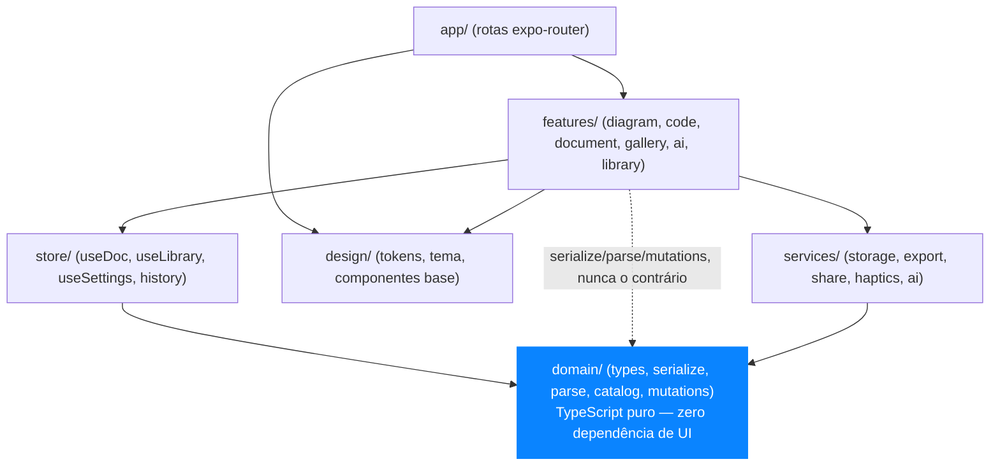
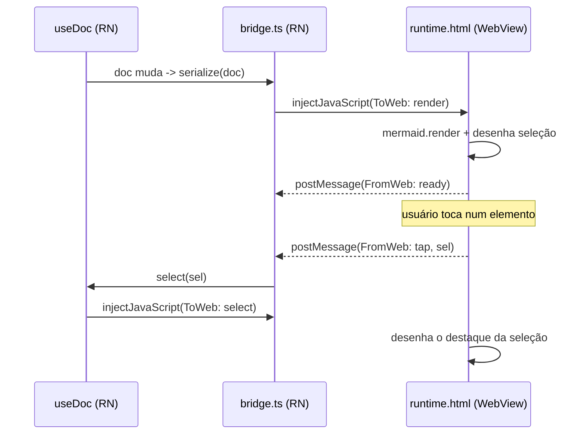
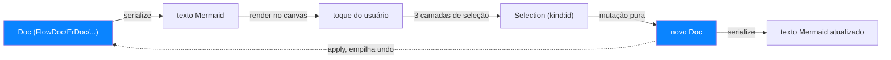
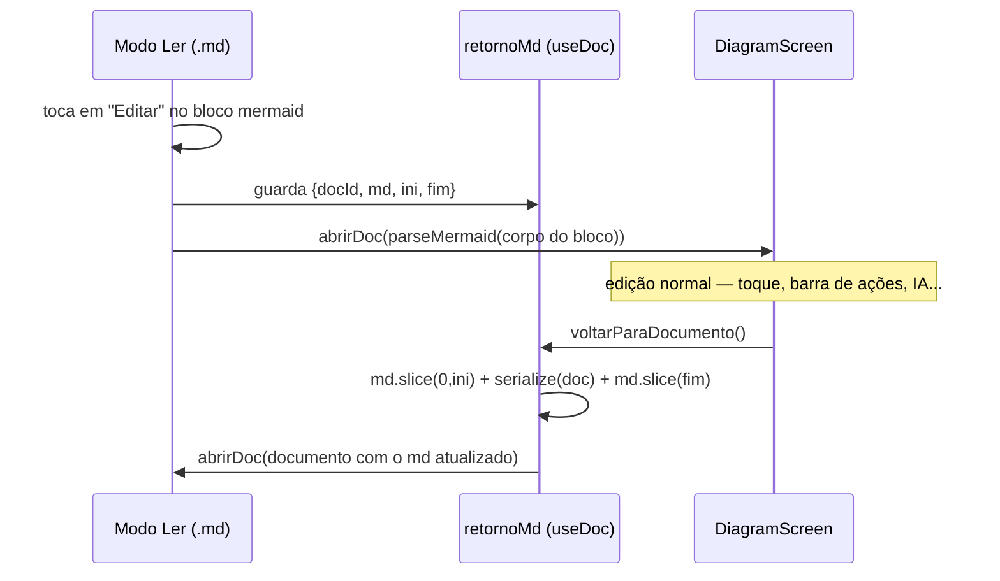
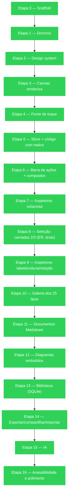

# Diagramas do projeto

Cinco fluxos em Mermaid — o próprio editor de Mermaid, documentado com Mermaid. Comece por
aqui antes de ler os docs individuais: dá a visão de relance da arquitetura e dos fluxos
centrais. Cada diagrama linka o doc que o detalha.

## 1. Arquitetura em camadas

`domain/` não importa nada de `features/`, `design/` ou `store/` — é a regra que mantém o
projeto escalável. Ver [02-setup-e-estrutura.md](02-setup-e-estrutura.md).



## 2. Ponte RN ↔ WebView

O WebView é um componente burro: desenha e reporta toques. Ver [06-canvas.md](06-canvas.md).



## 3. Ciclo do modelo — a "regra de ouro"

O texto Mermaid nunca é editado por regex durante a interação: é derivado do modelo e é
entrada do modelo. Ver [04-dominio.md](04-dominio.md).



## 4. Ida e volta documento ↔ diagrama

Um bloco ` ```mermaid ` dentro de um `.md` abre no canvas e volta atualizado, recortado no
offset exato. Ver [10-markdown.md](10-markdown.md).



## 5. Roteiro de build

Estado no momento desta versão do arquivo — a fonte viva é o
[CHECKLIST.md](../CHECKLIST.md), atualize este diagrama se o status mudar (regra de
manutenção no topo do [CLAUDE.md](../CLAUDE.md)).


